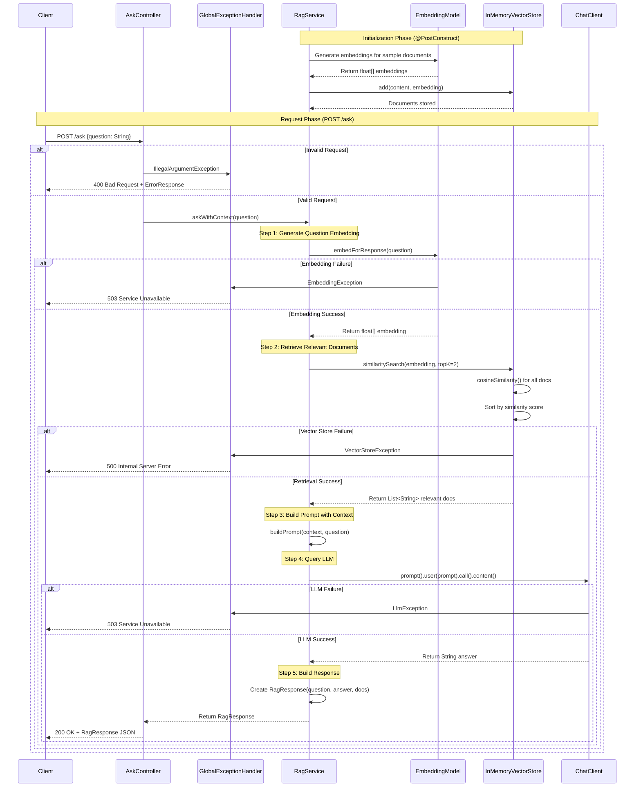
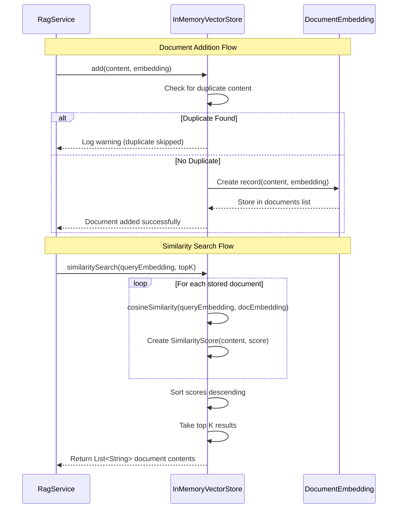
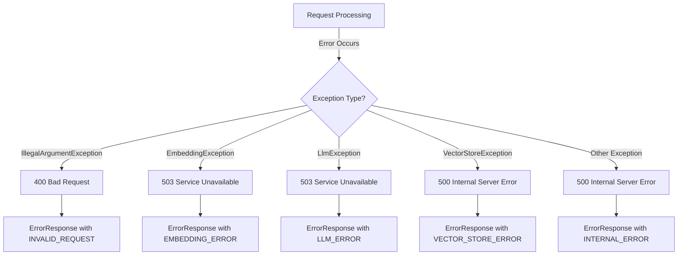

# RAG Application - Architecture & Request Flow Documentation

## Table of Contents

1. [Overview](#overview)
2. [Architecture Pattern](#architecture-pattern)
3. [Main Request Flow Sequence Diagram](#main-request-flow-sequence-diagram)
4. [Vector Store Operations Diagram](#vector-store-operations-diagram)
5. [Component Details](#component-details)
6. [Data Flow](#data-flow)
7. [Exception Handling](#exception-handling)
8. [Configuration](#configuration)

---

## Overview

This is a Spring Boot application implementing a **RAG (Retrieval-Augmented Generation)** pattern using Azure OpenAI
services. The application:

- Accepts user questions via REST API
- Generates embeddings for questions
- Retrieves semantically similar documents from an in-memory vector store
- Augments LLM prompts with retrieved context
- Returns contextually-grounded answers

**Technology Stack:**

- Spring Boot 3.2.1
- Spring AI 1.0.0-M4
- Azure OpenAI (Embeddings & Chat)
- Java 17+
- Maven

**Server Port:** 8080

---

## Architecture Pattern

The application follows a **layered architecture** with clear separation of concerns:

```
┌─────────────────────────────────────┐
│     Presentation Layer              │
│     (AskController)                 │
└──────────────┬──────────────────────┘
               │
┌──────────────▼──────────────────────┐
│     Business Logic Layer            │
│     (RagService)                    │
└──────────────┬──────────────────────┘
               │
┌──────────────▼──────────────────────┐
│     Data Access Layer               │
│     (InMemoryVectorStore)           │
└─────────────────────────────────────┘

Cross-Cutting Concerns:
├── GlobalExceptionHandler
├── Logging (SLF4J)
└── Spring AI Integration (ChatClient, EmbeddingModel)
```

---

## Main Request Flow Sequence Diagram



---

## Vector Store Operations Diagram



---

## Component Details

### 1. Controller Layer

#### AskController

**Location:** `src/main/java/com/example/rag/controller/AskController.java`

**Responsibilities:**

- Handles HTTP POST requests to `/ask` endpoint
- Validates incoming requests
- Delegates business logic to RagService
- Returns structured JSON responses

**Key Methods:**

- `ask(QuestionRequest request)` - Main endpoint handler

**Request Format:**

```json
{
  "question": "What is Spring Boot?"
}
```

**Response Format:**

```json
{
  "question": "What is Spring Boot?",
  "answer": "Spring Boot is...",
  "relevant_documents": [
    "Document 1 content...",
    "Document 2 content..."
  ]
}
```

---

### 2. Service Layer

#### RagService

**Location:** `src/main/java/com/example/rag/service/RagService.java`

**Responsibilities:**

- Orchestrates the RAG workflow
- Manages question embedding generation
- Retrieves relevant documents from vector store
- Builds prompts with context
- Queries the LLM for answers
- Initializes vector store with sample documents

**Key Methods:**

- `askWithContext(String question)` - Main RAG workflow orchestrator
- `generateEmbedding(String text)` - Creates vector embeddings
- `buildPrompt(String context, String question)` - Formats prompts
- `callLlm(String prompt)` - Queries Azure OpenAI Chat API
- `init()` - @PostConstruct method to load sample documents

**RAG Workflow Steps:**

1. Generate embedding for user question
2. Retrieve top 2 most similar documents from vector store
3. Build prompt with retrieved context
4. Query LLM with augmented prompt
5. Return structured response with answer and sources

**Configuration:**

- `topK = 2` - Retrieves top 2 most relevant documents

---

### 3. Repository Layer

#### InMemoryVectorStore

**Location:** `src/main/java/com/example/rag/repository/InMemoryVectorStore.java`

**Responsibilities:**

- Stores document embeddings in memory
- Performs similarity search using cosine similarity
- Prevents duplicate document storage
- Manages vector operations

**Key Methods:**

- `add(String content, float[] embedding)` - Adds documents to store
- `similaritySearch(float[] queryEmbedding, int topK)` - Finds similar documents
- `cosineSimilarity(float[] a, float[] b)` - Computes vector similarity

**Internal Records:**

- `DocumentEmbedding(String content, float[] embedding)` - Storage unit
- `SimilarityScore(String content, double score)` - Search result

**Similarity Algorithm:**

- Uses **cosine similarity** to measure vector similarity
- Formula: `similarity = (A · B) / (||A|| * ||B||)`
- Returns documents sorted by similarity score (descending)

---

### 4. Exception Handling

#### GlobalExceptionHandler

**Location:** `src/main/java/com/example/rag/handler/GlobalExceptionHandler.java`

**Responsibilities:**

- Centralized exception handling using @RestControllerAdvice
- Maps exceptions to appropriate HTTP status codes
- Returns structured error responses

**Exception Mappings:**

| Exception                  | HTTP Status               | Error Code         |
|----------------------------|---------------------------|--------------------|
| `IllegalArgumentException` | 400 Bad Request           | INVALID_REQUEST    |
| `EmbeddingException`       | 503 Service Unavailable   | EMBEDDING_ERROR    |
| `LlmException`             | 503 Service Unavailable   | LLM_ERROR          |
| `VectorStoreException`     | 500 Internal Server Error | VECTOR_STORE_ERROR |
| `Exception` (generic)      | 500 Internal Server Error | INTERNAL_ERROR     |

**Error Response Format:**

```json
{
  "status": 400,
  "message": "Question cannot be empty",
  "error_code": "INVALID_REQUEST",
  "timestamp": "2024-01-18T10:30:45.123Z"
}
```

---

### 5. Custom Exceptions

All custom exceptions extend `RuntimeException`:

#### EmbeddingException

**Location:** `src/main/java/com/example/rag/exception/EmbeddingException.java`

- Thrown when embedding generation fails
- Wraps Azure OpenAI embedding errors

#### LlmException

**Location:** `src/main/java/com/example/rag/exception/LlmException.java`

- Thrown when LLM interaction fails
- Wraps Azure OpenAI chat completion errors

#### VectorStoreException

**Location:** `src/main/java/com/example/rag/exception/VectorStoreException.java`

- Thrown when vector store operations fail
- Wraps storage and retrieval errors

---

## Data Flow

### Data Structures

**Request Objects:**

- `QuestionRequest` - Input record with `question` field

**Response Objects:**

- `RagResponse` - Output record with `question`, `answer`, `relevant_documents`
- `ErrorResponse` - Error record with `status`, `message`, `error_code`, `timestamp`

**Internal Data:**

- `float[]` - Vector embeddings (typically 1536 dimensions for Azure OpenAI)
- `DocumentEmbedding` - Pairs document content with embedding vector
- `SimilarityScore` - Pairs document content with similarity score

### Complete Data Flow

```
1. External Request (JSON)
   ↓
2. QuestionRequest {question: String}
   ↓
3. String (question)
   ↓
4. EmbeddingModel → float[] (question embedding)
   ↓
5. InMemoryVectorStore → List<String> (relevant documents)
   ↓
6. String (context = joined documents)
   ↓
7. String (formatted prompt)
   ↓
8. ChatClient → String (LLM answer)
   ↓
9. RagResponse {question, answer, relevantDocuments}
   ↓
10. JSON Response
```

---

## Exception Handling

### Exception Flow



---

## Configuration

### Application Properties

**Location:** `src/main/resources/application.properties`

**Key Configuration:**

```properties
server.port=8080
# Azure OpenAI Configuration
spring.ai.azure.openai.api-key=${AZURE_OPENAI_API_KEY}
spring.ai.azure.openai.endpoint=${AZURE_OPENAI_ENDPOINT}
spring.ai.azure.openai.chat.options.deployment-name=${AZURE_OPENAI_CHAT_DEPLOYMENT}
spring.ai.azure.openai.embedding.options.deployment-name=${AZURE_OPENAI_EMBEDDING_DEPLOYMENT}
```

### Environment Variables Required

| Variable                            | Description                           |
|-------------------------------------|---------------------------------------|
| `AZURE_OPENAI_API_KEY`              | Azure OpenAI API authentication key   |
| `AZURE_OPENAI_ENDPOINT`             | Azure OpenAI service endpoint URL     |
| `AZURE_OPENAI_CHAT_DEPLOYMENT`      | Chat completion model deployment name |
| `AZURE_OPENAI_EMBEDDING_DEPLOYMENT` | Embedding model deployment name       |

---

## API Documentation

### POST /ask

**Description:** Submit a question and receive a contextually-grounded answer using RAG.

**Request:**

```http
POST /ask HTTP/1.1
Content-Type: application/json

{
  "question": "What is the capital of France?"
}
```

**Success Response (200 OK):**

```json
{
  "question": "What is the capital of France?",
  "answer": "Paris is the capital of France.",
  "relevant_documents": [
    "France is a country in Europe with Paris as its capital.",
    "Paris, the capital city of France, is known for the Eiffel Tower."
  ]
}
```

**Error Response (400 Bad Request):**

```json
{
  "status": 400,
  "message": "Question cannot be empty",
  "error_code": "INVALID_REQUEST",
  "timestamp": "2024-01-18T10:30:45.123Z"
}
```

**Error Response (503 Service Unavailable):**

```json
{
  "status": 503,
  "message": "Failed to generate embedding",
  "error_code": "EMBEDDING_ERROR",
  "timestamp": "2024-01-18T10:30:45.123Z"
}
```

---

## Key File References

| Component         | File Path                                                           | Lines   |
|-------------------|---------------------------------------------------------------------|---------|
| Main Entry Point  | `src/main/java/com/example/rag/RagApplication.java`                 | 1-13    |
| REST Controller   | `src/main/java/com/example/rag/controller/AskController.java`       | 1-31    |
| RAG Service       | `src/main/java/com/example/rag/service/RagService.java`             | 1-77    |
| Vector Store      | `src/main/java/com/example/rag/repository/InMemoryVectorStore.java` | 1-67    |
| Exception Handler | `src/main/java/com/example/rag/handler/GlobalExceptionHandler.java` | 1-50    |
| Custom Exceptions | `src/main/java/com/example/rag/exception/`                          | Various |
| Configuration     | `src/main/resources/application.properties`                         | 1-6     |

---

## Summary

This RAG application demonstrates a clean, layered architecture for implementing Retrieval-Augmented Generation using
Spring Boot and Azure OpenAI. The key innovation is the use of vector similarity search to provide relevant context to
the LLM, enabling more accurate and grounded responses.

**Core RAG Workflow:**

1. **Embed** - Convert questions to vector representations
2. **Retrieve** - Find semantically similar documents
3. **Augment** - Enhance prompts with retrieved context
4. **Generate** - Produce contextually-grounded answers

**Strengths:**

- Clear separation of concerns
- Comprehensive error handling
- Type-safe data structures using Java records
- Extensible architecture for additional document sources
- Built on Spring AI abstractions for vendor portability

**Potential Enhancements:**

- Persistent vector storage (PostgreSQL with pgvector, Pinecone, etc.)
- Document upload API for dynamic content
- Caching layer for frequently asked questions
- Streaming responses for real-time feedback
- Document chunking for large texts
- Metadata filtering for targeted retrieval
